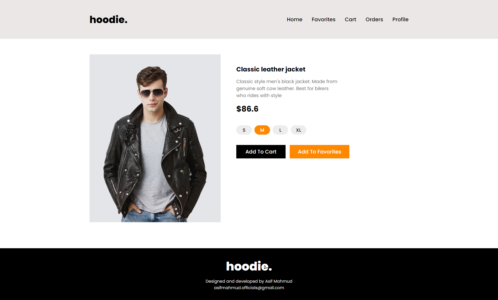
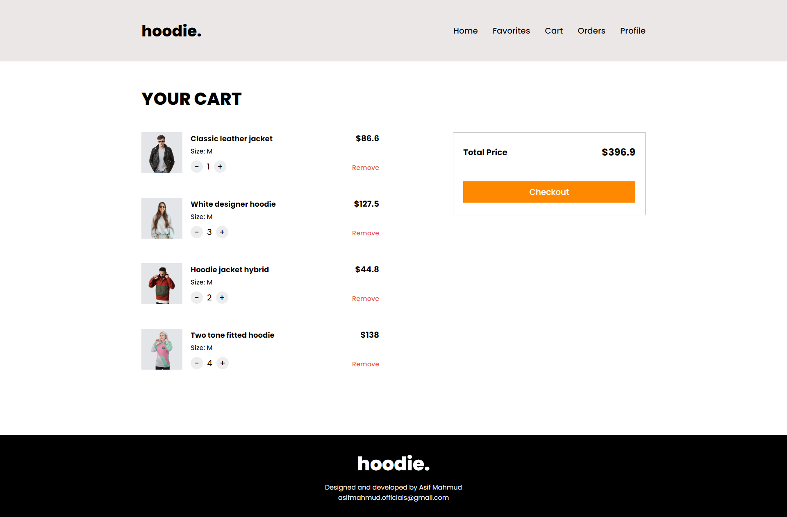
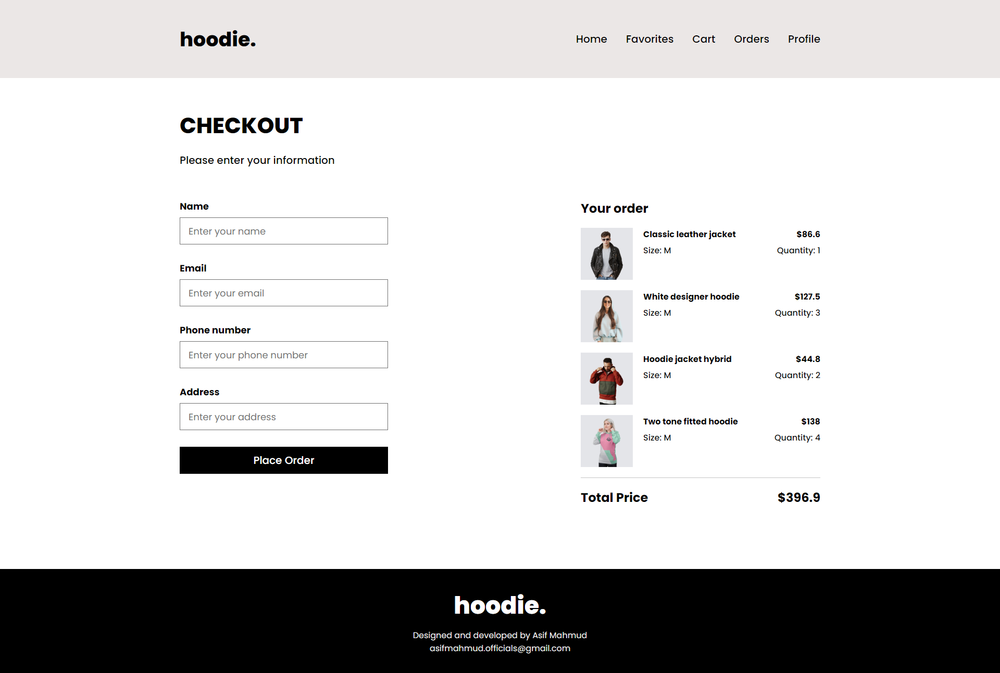
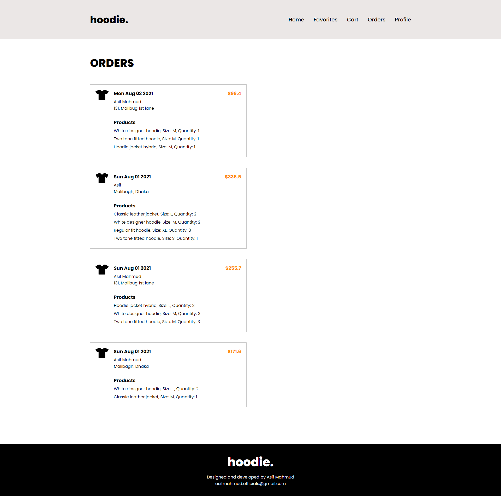
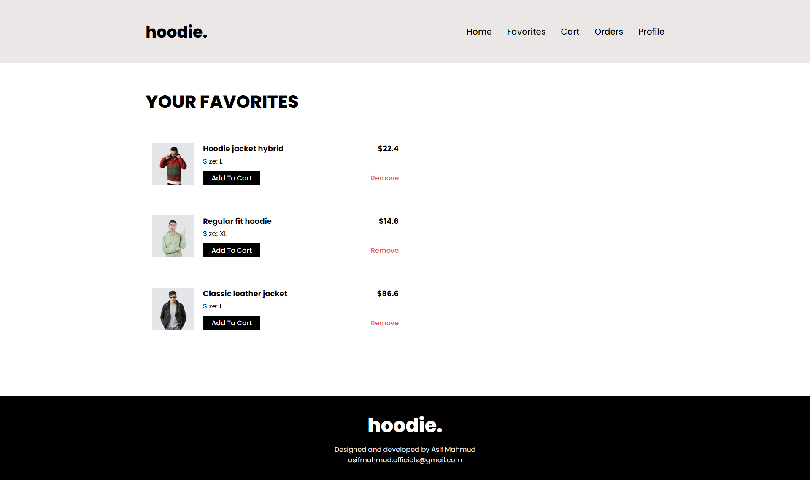
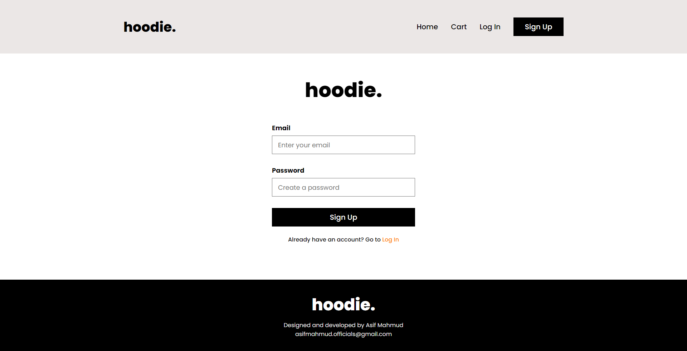

# Hoodie

An ecommerce store for hoodies and jackets.

## Live App

Please checkout the live app here [Hoodie](https://hoodie-94315.web.app/)

## App Features

- Fully functional ecommerce store
- User authentication
- Cart functionality
- Realtime add/remove favorites functionality
- Up to date orders list
- User friendly UI/UX

## Technologies Used

- React
- Firebase (Authentication, Cloud Firestore, Cloud Storage)
- Context API
- React Router

## Quick Start

1. Clone this git repository.

2. Run `$ npm install` in your terminal from the project directory.

3. Create a Firebase project. Enable Cloud Firestore, also enable Email and Password Authentication for the project. Then register a web app.

4. Create a `.env` file in project root and save your firebase app config in this file. See the `firebase.js` file for understanding the properties needed in `.env` file.

5. Create a `products` collection in Cloud Firestore and fill it with the necessary data for the project. Please check `Home` , `HomeProduct` and `Product` component in the project for understanding what data is beign fetched from this collection. This is an imporntant step. The `products` collection must be made manually with the proper data for the project.

6. Run `$ npm start` in your terminal to see the project in localhost.

## Screenshots

### Home Page

### Product Page

### Cart Page

### Checkout Page

### Orders Page

### Favorites Page

### Signup Page

